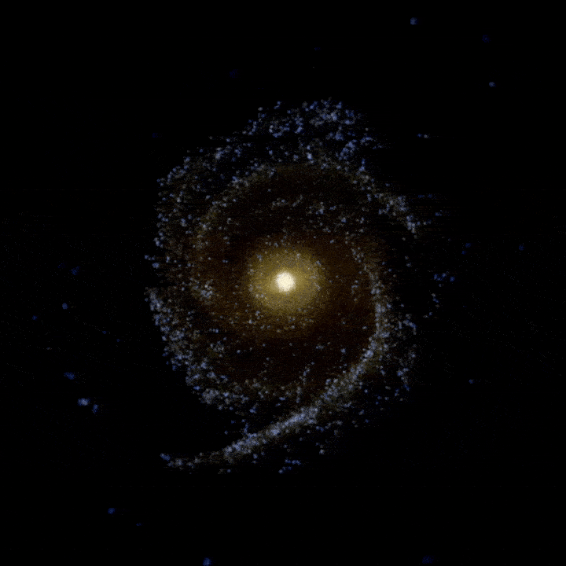

# welcome to my ~~ㅤhumbleㅤ~~ *spiraling* abode

the below gifs were created using the [dancing_galaxies](https://github.com/deliriousMathematician/dancing_galaxies) repo:

  
   
  

<h6 align="center">Time animations of the Stellar, Dust, and Gaseous components of a galactic simulation (15 kpc)</h6>

#

## toDoList:
- local pdf combiner/arranger
- get familiar with github pages
- get comfy w/ html 'n css
- start work on website
- mess around w/ php &or javascript
- double pendulum website applet
- mandelbrot on website
- . . .

not much else to see - for now.....
